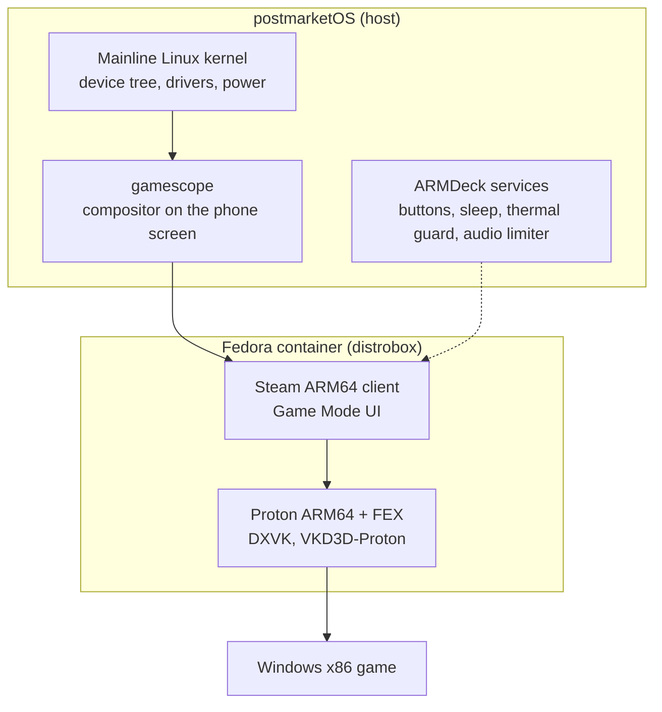

  

  <b>Turn a Snapdragon phone into a Linux gaming handheld.</b> 
  Mainline Linux, Steam in Game Mode and Windows games through Proton ARM64. No Android.

  
  
  
  

<!--
  Hero image goes here once it exists, for example:
  

-->

> [!WARNING]
> ARMDeck replaces Android completely. The phone is wiped, and calls, SMS and mobile data stop
> working. Read [Hardware safety](docs/hardware-safety.md) before you flash anything.

## What it is

ARMDeck takes a phone with a Qualcomm Snapdragon chip, wipes Android and boots a mainline Linux
kernel on postmarketOS. On top of that runs the Steam client for ARM64 in Game Mode, inside
gamescope, the same compositor the Steam Deck uses. Windows games run through Proton ARM64 and
the FEX x86 emulator. The result is a dedicated console: no apps, no notifications, just Steam.

One person cannot port every phone. ARMDeck is the shared stack plus a contribution process,
so the community can bring it to more devices and keep them working.

## How it works

- **postmarketOS** runs the hardware. Steam needs glibc, postmarketOS uses musl, so Steam runs
  in a Fedora container that shares the GPU, sound and home folder with the host. It is not a
  virtual machine and costs no performance.
- **Steam** starts in its Steam Deck mode. Its power, brightness and update calls are answered
  by small ARMDeck adapters on the host.
- **Proton** translates Windows calls to Linux, **FEX** translates x86 code to ARM64, and
  **Turnip** (Mesa) drives the Adreno GPU through Vulkan.

## Devices

| Device | Variants tested | SoC / GPU | Status |
|---|---|---|---|
| OnePlus 8 (`instantnoodle`) | IN2013 | Snapdragon 865 / Adreno 650 | Daily use |

Phones sold under one name often differ by region: modem, radio board, sometimes the panel.
Each entry lists the exact variants tested on real hardware. Anything else is untested until
someone reports it. Want your phone here? See [Contributing](CONTRIBUTING.md).

## What works on the OnePlus 8

- Steam Game Mode, full screen at the native 2400x1080, touch like on a Steam Deck
- Windows games through Proton 11 ARM64, performance overlay (MangoHud)
- Controllers over USB and Bluetooth (tested: Xbox, GameSir X3 Pro)
- Sound through a protected speaker output, Wi-Fi, Bluetooth
- Volume Up + Volume Down opens the Steam menu, even in games
- Kernel with NTSYNC, full preemption and MGLRU
- Charging limited to 5 V, battery-temperature thermal guard

**Not yet:** deep sleep (the screen-off drain is being reduced step by step), native x86 Linux
games (they need an x86 Mesa for FEX; use the Windows version through Proton for now), Proton
Experimental ARM64 (its DXVK 3 needs a GPU feature the Adreno 650 lacks) and Remote Play
(a bug in Valve's ARM64 client). Details in the
[compatibility and performance audit](docs/compat-perf-audit.md).

## Install

There is no one-step installer yet. Today an install means building the kernel and device
packages with pmbootstrap, flashing the phone, then running the setup scripts:

1. [Hardware safety](docs/hardware-safety.md): what can go wrong and how to back up first.
2. [Build environment](docs/build-environment.md): building the packages and the image.
3. [Userspace setup](userspace/README.md): Steam session, buttons, sound, sleep, logging.

## Contributing

Device ports, game reports, fixes and documentation are all welcome. The rules are short and
about fairness: be honest about what you tested, keep hardware changes within the
manufacturer's limits, credit other people's work, say when AI helped you, and respect the
projects we build on. Read [CONTRIBUTING.md](CONTRIBUTING.md) and the
[Code of Conduct](CODE_OF_CONDUCT.md).

## How this is built

The maintainer develops ARMDeck with AI assistance (Claude models), for research, source
verification, packaging and build work. Every non-obvious claim is traced to a primary
source (a vendor file, a real build, a measurement on the phone) in the
[verification log](docs/verification-log.md), so the work can be checked rather than taken on
faith. If AI involvement rules a project out for you, that is a fair choice.

## Thanks

### Inspired by

- [DroidDeck](https://github.com/Droid-Deck/DroidDeck): Steam on Android handhelds; the model
  for this README and for device reports.
- [pocknix-os](https://github.com/shuuri-labs/pocknix-os): Steam ARM64 in Game Mode on a
  handheld, the first-run registry and the DXVK approach for Proton ARM64.
- [Armada](https://github.com/armada-os/armada): EDID handling for internal panels and the
  x86 Mesa root for FEX.
- [SteamOS-ARM-Handhelds](https://github.com/hashtagbasit/SteamOS-ARM-Handhelds): display
  profiles for phone panels.
- [ROCKNIX](https://github.com/ROCKNIX/distribution): Linux on ARM handhelds, x86 Mesa for FEX.
- [Nova-Deck](https://github.com/Nova-Deck/os-build): the DXVK 3 findings on the Adreno 650.
- [SteamOS and the Steam Deck](https://store.steampowered.com/steamdeck), and
  [Bazzite](https://bazzite.gg): what a Linux gaming handheld should feel like.

### Built on

- [postmarketOS](https://postmarketos.org): the base system, pmbootstrap, mkinitfs,
  [bootmac](https://gitlab.postmarketos.org/postmarketOS/bootmac). Please note that
  postmarketOS does not accept AI-assisted contributions; see [CONTRIBUTING.md](CONTRIBUTING.md).
- Kernel and device trees for the OnePlus 8:
  [Xo666/mainline-instantnoodle](https://github.com/Xo666/mainline-instantnoodle) (the kernel
  ARMDeck uses), [ObiKeahloa/linux](https://gitlab.com/ObiKeahloa/linux),
  [WuerfelDev/linux-sm8250](https://gitlab.postmarketos.org/WuerfelDev/linux-sm8250), and the
  [LineageOS OnePlus SM8250 kernel](https://github.com/LineageOS/android_kernel_oneplus_sm8250),
  used as the vendor reference for every hardware value.
- Valve: the Steam client, [Proton](https://github.com/ValveSoftware/Proton) and
  [gamescope](https://github.com/ValveSoftware/gamescope).
- [FEX](https://github.com/FEX-Emu/FEX), [DXVK](https://github.com/doitsujin/dxvk),
  [VKD3D-Proton](https://github.com/HansKristian-Work/vkd3d-proton),
  [Mesa](https://gitlab.freedesktop.org/mesa/mesa) (Turnip and Freedreno).
- [MangoHud](https://github.com/flightlessmango/MangoHud) and the session setup from
  [ChimeraOS gamescope-session-steam](https://github.com/ChimeraOS/gamescope-session-steam).
- [Fedora](https://fedoraproject.org), [distrobox](https://github.com/89luca89/distrobox),
  [Podman](https://github.com/containers/podman),
  [PipeWire](https://gitlab.freedesktop.org/pipewire/pipewire) and
  [WirePlumber](https://gitlab.freedesktop.org/pipewire/wireplumber),
  [python-evdev](https://github.com/gvalkov/python-evdev),
  [qbootctl](https://github.com/linux-msm/qbootctl), Alpine Linux.

## License

ARMDeck's own files (documents, scripts, packaging) are MIT licensed, see [LICENSE](LICENSE).
Kernel patches are GPL-2.0, like the kernel they apply to. The device trees under
`reference/dts/` come from the kernel forks listed above and keep their own SPDX headers
(GPL-2.0 or BSD, dual licensed). Firmware is never included: it is proprietary and is copied
from your own phone.

## Disclaimer

ARMDeck is an independent project. It is not affiliated with, endorsed or sponsored by Valve,
OnePlus, Qualcomm, Google, the postmarketOS project or the authors of the kernel forks it uses.
Steam and Steam Deck are trademarks of Valve Corporation; all trademarks belong to their
owners.

Everything here is provided as is, without warranty of any kind. Flashing a phone carries real
risk, including a bricked device, data loss and hardware damage. The authors and contributors
accept no liability for any damage or loss from using this project. By installing it on a
device you accept that risk.
